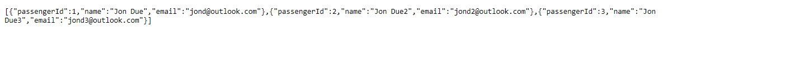

# Module 4: Extending ASP.NET Core HTTP services

# Lesson 3: Injecting Dependencies into Controllers

### Demonstration: Using Dependency Injection with Controllers

- Abrimos el proyecto CustomFiltersAndFormatters en Visual Studio Code

- Restauramos el proyecto

- Creamos la interface IPassengerRepository en el proyecto **BlueYonder.Flights.DAL**

- Implementamos la interface en la clase PassengerRepository

- En el middleware del proyecto **BlueYonder.Flights.Service** añadimos el servicio AddTransient

- En el controlador Passenger inyectamos la dependencia a PassengerRepository

- Ejecutamos y verificamos que recibimos los datos

  

